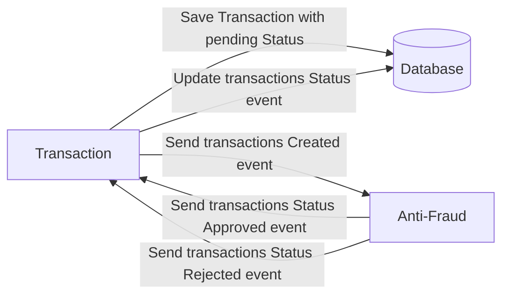

# Solution

To solve the technical challenge, apply everything requested, first create a microservice that subscribes to Kafka topics and with this can create transactions in the DB and in the respective Topic and the second microservice is responsible for subscribing to the Kafka topic. creation to obtain the amount and be able to validate whether it is fraudulent or not according to the condition provided, in case the fraud microservice is restarted it will resume all the requests that were pending to analyze whether or not it was a fraud, the technological stack en Reactive programming with Java 17 (webflux), as well as GraphQL, H2 database with JPA, were used for the requests.


# Yape Code Challenge :rocket:

Our code challenge will let you marvel us with your Jedi coding skills :smile:. 

Don't forget that the proper way to submit your work is to fork the repo and create a PR :wink: ... have fun !!

- [Yape Code Challenge :rocket:](#yape-code-challenge-rocket)
- [Problem](#problem)
- [Tech Stack](#tech-stack)
  - [Optional](#optional)
- [Send us your challenge](#send-us-your-challenge)
- [Solution](#solution)

# Problem

Every time a financial transactions is created it must be validated by our anti-fraud microservice and then the same service sends a message back to update the transactions status.
For now, we have only three transactions statuses:

<ol>
  <li>pending</li>
  <li>approved</li>
  <li>rejected</li>  
</ol>

Every transactions with a value greater than 1000 should be rejected.



# Tech Stack

<ol>
  <li>Java. You can use any framework you want</li>
  <li>Any database</li>
  <li>Kafka</li>
</ol>

We do provide a `Dockerfile` to help you get started with a dev environment.

You must have two resources:

1. Resource to create a transactions that must containt:

```json
{
  "accountExternalIdDebit": "Guid",
  "accountExternalIdCredit": "Guid",
  "tranferTypeId": 1,
  "value": 120
}
```

2. Resource to retrieve a transactions

```json
{
  "transactionExternalId": "Guid",
  "transactionType": {
    "name": ""
  },
  "transactionStatus": {
    "name": ""
  },
  "value": 120,
  "createdAt": "Date"
}
```

## Optional

You can use any approach to store transactions data but you should consider that we may deal with high volume scenarios where we have a huge amount of writes and reads for the same data at the same time. How would you tackle this requirement?

You can use Graphql;

# Send us your challenge

When you finish your challenge, after forking a repository, you **must** open a pull request to our repository. There are no limitations to the implementation, you can follow the programming paradigm, modularization, and style that you feel is the most appropriate solution.

If you have any questions, please let us know.


